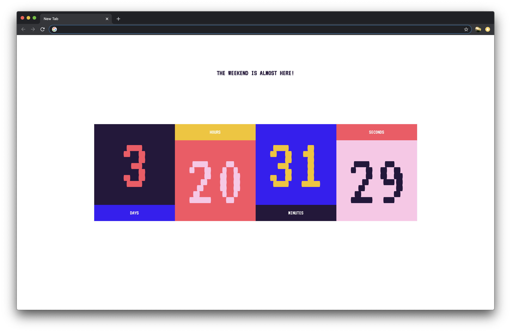

*A new tab plugin counting you down to the weekend*

This was a quick project born out of my desire to create a chrome plugin after seeing Tim Holman's _[What have you made today?](http://tholman.com/post/what-have-you-made-today/)_ new tab Chrome plugin. Looking forward to the weekend in which I would have time to create this, the idea sprung up to create this countdown timer.

From a technical perspective this project was really straightforward. It was built using vanilla HTML, CSS and Javascript (and a little help from Moment.js). No framework, task-runner or module bundler was used otherwise.

[See it on Github](https://github.com/ricominten/time-until-chrome-plugin)
[Get it here](https://chrome.google.com/webstore/detail/is-it-almost-the-weekend/apgkfkpjnohmpjfacmeeapfpjhoanljm)